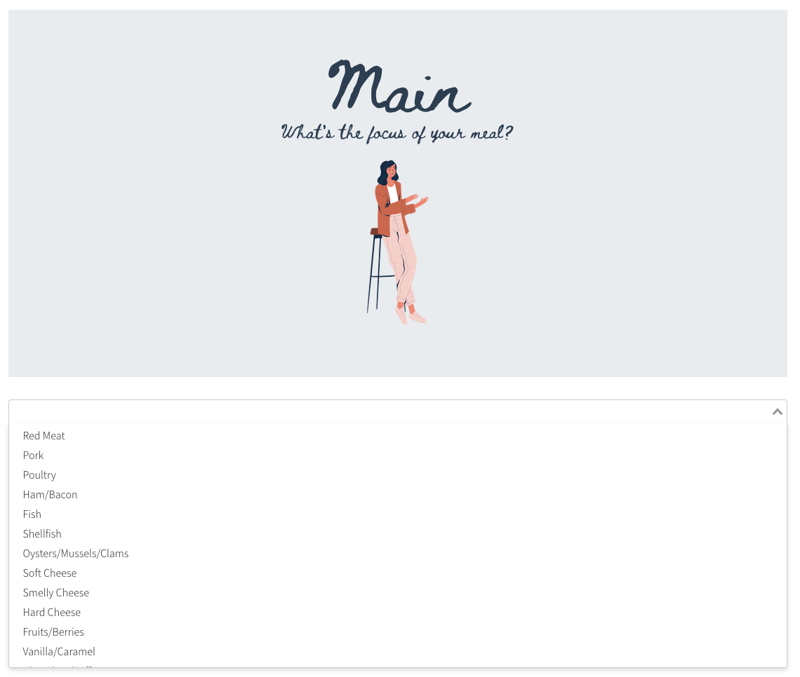
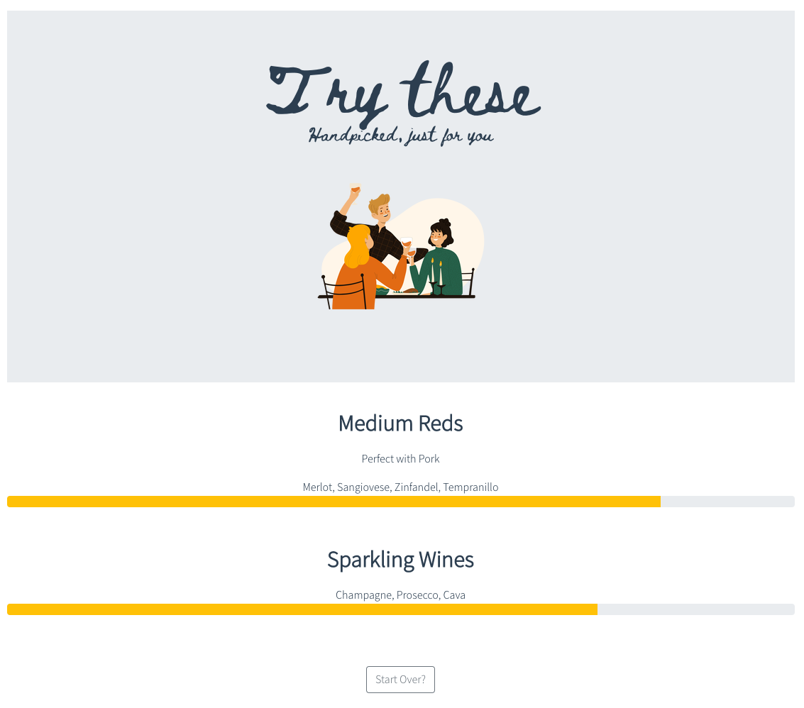

#[Pairswell](https://upbeat-hamilton-bd0911.netlify.app)


#### A web-app designed to help users discover the perfect wines to pair with thier meals
##### A General Assembly software engineering project created by [Ryan Bullough](https://github.com/rjbullough)


Pairswell was built using **Vue.js**

**It features**

1. A simple UI allowing users to pick the components that make up their meal
   

---

2. Ranked results based on user choices
   

---


### Challenges faced

Implementing Vuex.  This was the first time i've used a centralised state storage solution
```
Vue.use(Vuex)

export default new Vuex.Store({
  state: {
    ingredients: {
      main: data.ingredients.filter(ingredient => ingredient.type === "main"),
      secondary: data.ingredients.filter(ingredient => ingredient.type === "secondary"),
      prep: data.ingredients.filter(ingredient => ingredient.type === "prep"),
      spice: data.ingredients.filter(ingredient => ingredient.type === "spice")
    },
    step: 1,
    selections: [],
    results: [],
  },
  mutations: {
    setMainSelection(state, selection) {
      state.selections[0] = selection.id;
    },
    setSecondarySelection(state, selection) {
      state.selections[1] = selection.id;
    },
    setPrepSelection(state, selection) {
      state.selections[2] = selection.id;
    },
    setSpiceSelection(state, selection) {
      state.selections[3] = selection.id;
    },
```

---

### To Do / Future features

1. I'd like to allow users to search nearby shops that sell the wine types reccommended for their meal!